# 🎯 InterviewPrep AI

### Your Complete Interview Preparation Platform

_Prepare. Practice. Perform._

---

📅 **Track your interview preparation journey**

---

## 🛠️ Tech-Stack


---

[Features](#features) • [Demo](#demo) • [Installation](#installation) • [Documentation](#documentation) • [Contributing](#contributing)

## 🌟 Table of Contents

- 🌟 [Overview](#-overview)
- ✨ [Key Features](#-key-features)
- 🛠️ [Tech Stack](#-tech-stack)
- 🖼️ [Screenshots](#-screenshots)
- 🚀 [Installation](#-installation--setup)
- ⚙️ [Environment Setup](#-environment-setup)
- 📁 [Project Structure](#-project-structure)
- 📊 [Progress Tracking](#-progress-tracking)
- 👨‍💼 [Admin Dashboard](#-admin-dashboard)
- 📄 [Purpose](#purpose)
- 🤝 [Contributing](#-contributing)
- 🙏 [Acknowledgments](#-acknowledgements)

## 🌟 Overview

InterviewPrep AI is a comprehensive interview preparation platform designed to help students and job seekers prepare for technical and HR interviews with confidence. The platform provides AI-powered mock interviews, coding practice, aptitude tests, company-specific interview questions, resume analysis, and progress tracking in a single place.

Whether you are preparing for campus placements, internships, or professional job interviews, InterviewPrep AI offers a structured learning experience to improve your technical knowledge, communication skills, and interview performance.

### 🎯 What We Offer

- 🎯 Skill-Based Evaluation
- 📄 Resume-Based Interview Generation
- 🤖 AI-Powered Mock Interviews
- 📊 AI Evaluation & Performance Analysis
- 🧠 Smart Skill Gap Analyzer
- 👤 Personalized User Dashboard
- 📝 Profile Management
- 🎙️ Speech-to-Text Integration
- 🔊 Text-to-Speech Support
- 📈 Progress Tracking & Analytics
- 💡 Personalized Improvement Suggestions
- 🏆 Interview Readiness Score

---

## ✨ Key Features
## ✨ Key Features

### 🎤 AI-Powered Mock Interviews
- Generate dynamic interview questions using AI
- Technical and HR interview simulations
- Real-time interview experience
- Personalized feedback after each session

### 📄 Resume-Based Interview Generation
- Upload your resume to generate customized interview questions
- Questions tailored to skills, projects, and experience
- Industry-specific interview preparation

### 📊 AI Evaluation & Feedback
- Intelligent performance analysis
- Detailed interview reports
- Strength and weakness identification
- Actionable improvement suggestions

### 🧠 Smart Skill Gap Analyzer
- Detect missing skills required for target roles
- Compare current skills with industry requirements
- Personalized learning recommendations

### 🎙️ Speech-to-Text Integration
- Convert spoken responses into text
- Practice verbal communication skills
- Improve interview confidence

### 🔊 Text-to-Speech Support
- AI reads interview questions aloud
- Realistic interview environment
- Improved accessibility and user experience

### 👤 User Dashboard & Profile Management
- Personalized dashboard
- Profile customization
- Interview history and performance records
- Track completed assessments

### 📈 Progress Tracking & Analytics
- Monitor preparation journey
- View performance trends and scores
- Track skill development and interview readiness

### 🏆 Interview Readiness Score
- Comprehensive readiness assessment
- Performance-based scoring system
- Track growth and preparation level

### 🔒 Secure Authentication
- User registration and login
- Protected routes and user data security
- JWT-based authentication system

### 📱 Responsive Design
- Mobile-friendly interface
- Seamless experience across devices
- Modern and intuitive user interface
---

## 🛠️ Tech Stack
## 🛠️ Tech Stack

### Frontend

<p>
  
</p>

- **React.js** – Component-Based User Interface Development
- **Vite** – Fast Build Tool and Development Server
- **Tailwind CSS** – Responsive and Modern UI Design
- **React Router** – Client-Side Routing
- **Axios** – API Communication

---

### Backend

<p>
  
</p>

- **Node.js** – Server-Side Runtime Environment
- **Express.js** – REST API Development
- **JWT** – Authentication & Authorization
- **Bcrypt** – Password Encryption

---

### Database

<p>
  
</p>

- **MongoDB Atlas** – Cloud Database
- **Mongoose** – ODM for MongoDB

---

### Artificial Intelligence

### 🤖 Artificial Intelligence

<p>
  
</p>

#### Google Gemini AI

- Resume-Based Interview Generation
- Skill Gap Analysis
- AI Interview Evaluation
- Personalized Feedback System

---

### 🎙️ Voice Features

<p>
  
</p>

#### Web Speech API

- Speech-to-Text Conversion
- Text-to-Speech Integration
- Voice-Based Interview Experience
- Real-Time Communication Analysis


- **Web Speech API**
  - Speech-to-Text Conversion
  - Text-to-Speech Integration

---

### Cloud & Services

<p>
  
</p>

- **Cloudinary** – Resume & Asset Storage
- **Nodemailer** – Email Notifications & OTP Verification

---

### Development Tools

<p>
  
</p>

- **Git & GitHub** – Version Control
- **VS Code** – Development Environment
- **Postman** – API Testing

---

### Architecture Overview

```text
Frontend      → React + Tailwind CSS
Backend       → Node.js + Express.js
Database      → MongoDB Atlas
Authentication→ JWT + Bcrypt
AI Engine     → Google Gemini AI
Voice Features→ Speech-to-Text & Text-to-Speech
Storage       → Cloudinary

```
---

## 🖼️ Screenshots

### 🚀 Main Application Pages

| 🤖 AI Smart Interview | 🏠 Landing Page |
|----------------------|----------------|
| 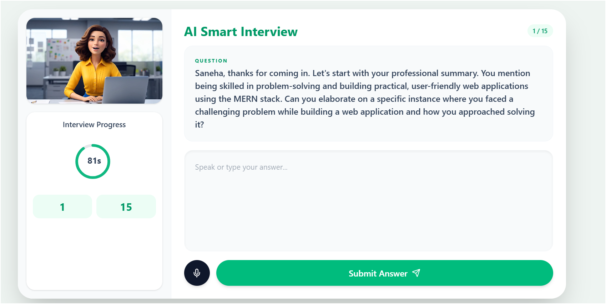 | 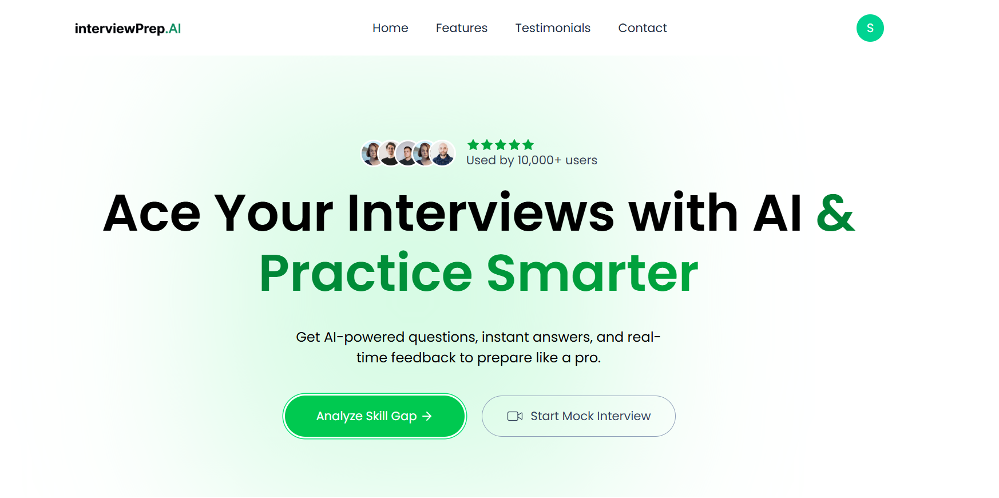 |
| AI-powered interview platform with intelligent evaluation and personalized feedback. | Modern landing page introducing the platform and its key features. |

---

| 👤 Profile Page | 📝 Quiz Page |
|---------------|-------------|
| 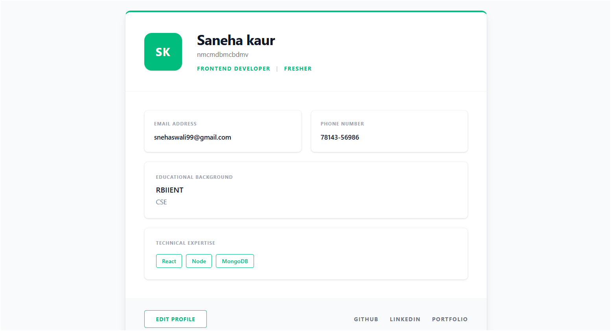 | 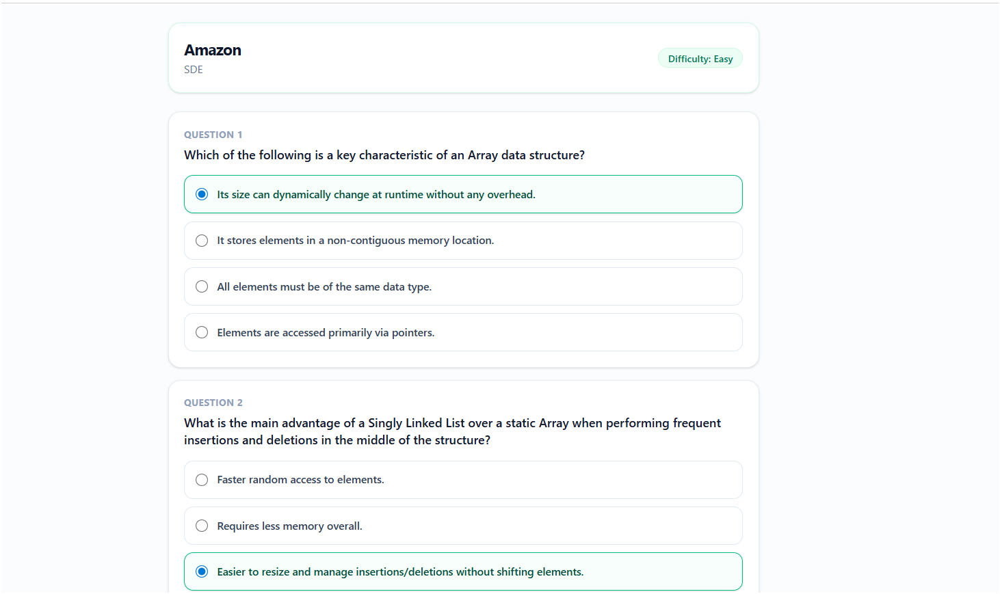 |
| Manage personal information, interview history, and account settings. | Practice technical and aptitude quizzes to improve interview readiness. |

---

| 🧠 Skill Gap Analyzer | 📊 Dashboard |
|----------------------|-------------|
| 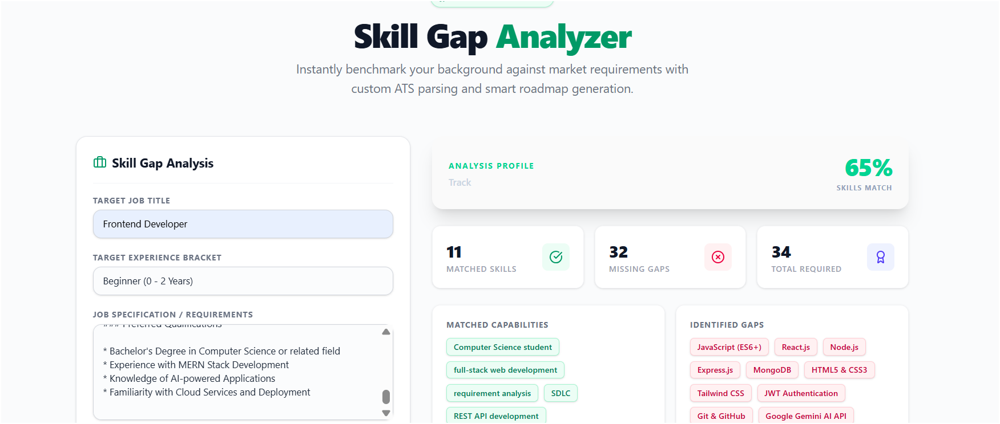 | 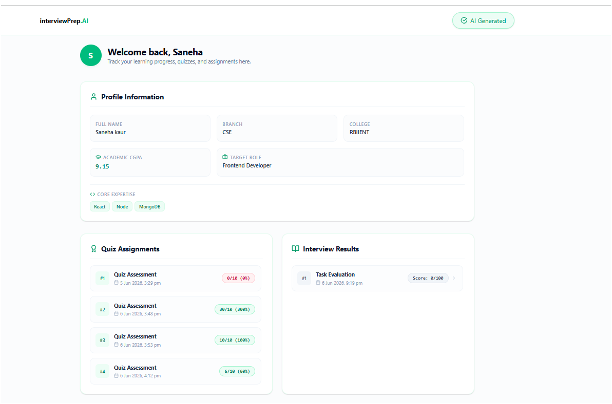 |
| Analyze strengths and weaknesses with AI-driven recommendations. | Track performance, interview scores, and learning progress. |

---

| 🎯 Generate Quiz | 📚 MCQ Practice |
|-----------------|----------------|
| 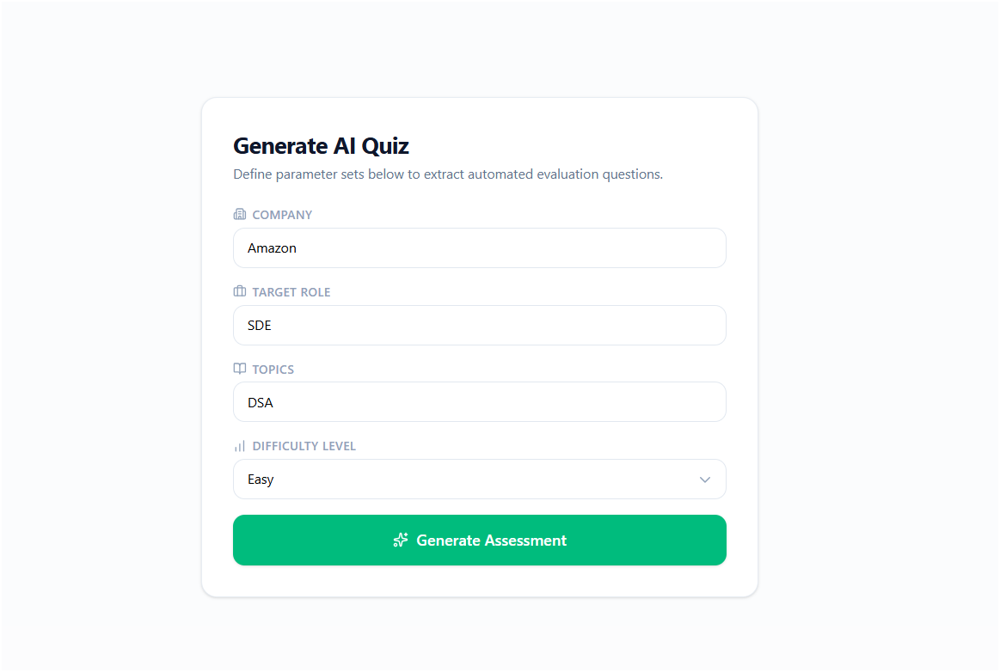 | 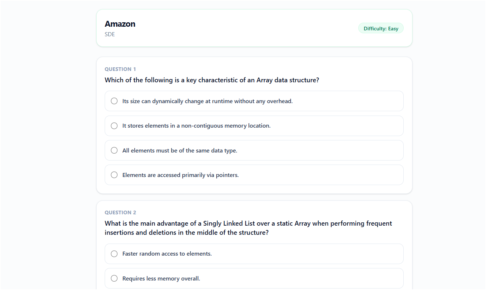 |
| Generate personalized quizzes based on skills and target job roles. | Practice topic-wise MCQs for technical and aptitude preparation. |

---

### 🔐 Authentication Pages

| 🔑 Login Page | 📝 Sign Up Page |
|--------------|----------------|
| 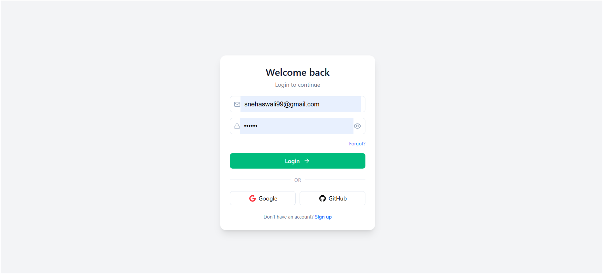 | 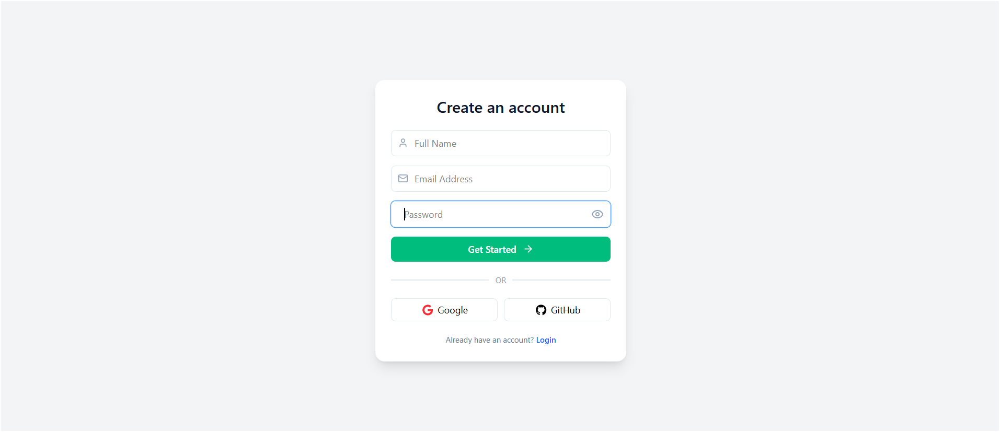 |
| Secure login system with authentication and user verification. | Create a new account and start your interview preparation journey. |

---

### 📈 Performance & Results

| 📊 Results Page | 🎤 Interview Evaluation |
|----------------|------------------------|
| 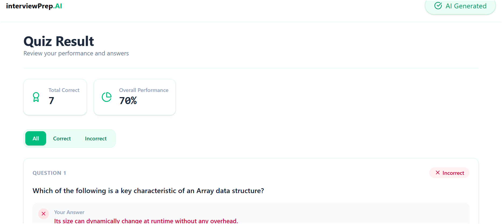 | 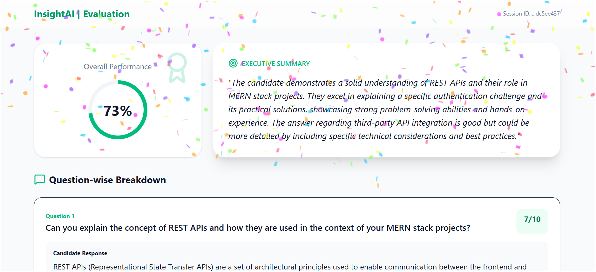 |
| View quiz scores, interview performance, and detailed analytics. | AI-generated feedback, strengths, weaknesses, and improvement suggestions. |


## 🚀 Installation & Setup


### 📌 Step 1: Clone the Repository

```bash
git clone https://github.com/your-username/your-repository-name.git
cd your-repository-name
```
### 📌 Step 2: Backend SetUp
```bash
cd backend

# Install dependencies
npm install express jsonwebtoken bcrypt mongoose cors multer cloudinary dotenv
npm install @google/generative-ai
npm install nodemon
```
### 📌 Frontend Setup

---

```bash
# 1. Create Vite project
npm create vite@latest frontend

# 2. Go to project folder
cd frontend

# 3. Install dependencies
npm install

# 4. Install Tailwind CSS (correct package)
npm install -D tailwindcss postcss autoprefixer
npx tailwindcss init -p

# 5. Install React Hot Toast (correct package)
npm install react-hot-toast
npm install react-router-dom
```
# Create environment file
cp .env.example .env
## ⚙️ Environment Setup
``` bash
PORT=8989

MONGO_URI=your_mongodb_connection_string

GEMINI_API_KEY=your_gemini_api_key

CLOUD_NAME=your_cloudinary_cloud_name
API_KEY=your_cloudinary_api_key
API_SECRET=your_cloudinary_api_secret

JWT_SECRET=your_jwt_secret_key
```
---

## 📁 Project Structure
 ### Backend Setup
 ``` bash
backend/
│
├── config/
│   ├── cloudinary.js
│   ├── db.js
│
├── controllers/
│   ├── auth.controller.js
│   ├── user.controller.js
│   ├── contact.controller.js
│   ├── dashboard.controller.js
│   ├── profile.controller.js
│   ├── skill.controller.js
│   ├── pdf.controller.js
│
├── middlewares/
│   ├── auth.middleware.js
│   ├── upload.middleware.js
│   ├── validate.middleware.js
│
├── models/
│   ├── user.model.js
│   ├── assignment.model.js
│   ├── contact.model.js
│   ├── interview.model.js
│   ├── result.model.js
│   ├── skillgap.model.js
│
├── routes/
│   ├── auth.routes.js
│   ├── user.routes.js
│   ├── contact.routes.js
│   ├── dashboard.routes.js
│   ├── profile.routes.js
│   ├── skill.routes.js
│   ├── result.routes.js
│
├── services/
│   ├── gemini.service.js
│   ├── interview.service.js
│   ├── assignment.service.js
│
├── uploads/
│   ├── (files uploaded here)
│
├── utils/
│   ├── jwt.js
│   ├── cloudinaryUpload.js
│   ├── apiResponse.js
│
├── validators/
│   ├── auth.validator.js
│   ├── user.validator.js
│
├── .env
├── server.js / index.js
├── package.json
 ```
### Frontend Structure

```bash
frontend/
│
├── dist/
├── node_modules/
├── public/
│
├── src/
│   │
│   ├── assets/
│   │
│   ├── Components/
│   │   │
│   │   ├── common/
│   │   │   └── Footer.jsx
│   │   │
│   │   ├── files/
│   │   │   ├── Companies.js
│   │   │   ├── Degree.js
│   │   │   ├── Roles.js
│   │   │   └── Topics.js
│   │   │
│   │   └── ui/
│   │       ├── Navbar.jsx
│   │       ├── Testimonial.jsx
│   │
│   ├── Pages/
│   │   ├── AISmartInterview.jsx
│   │   ├── CreateP.jsx
│   │   ├── Dashboard.jsx
│   │   ├── Evaluate.jsx
│   │   ├── EvaluateInterviewSession.jsx
│   │   ├── Feature.jsx
│   │   ├── GetQuizPage.jsx
│   │   ├── Home.jsx
│   │   ├── Login.jsx
│   │   ├── Profile.jsx
│   │   ├── QuizPage.jsx
│   │   ├── QuizResultPage.jsx
│   │   ├── ResumeInterview.jsx
│   │   ├── Signup.jsx
│   │   ├── SkillGapForm.jsx
│   │   ├── SkillGapResult.jsx
│   │   ├── StartInterviewForm.jsx
│   │   ├── UserProfileForm.jsx
│   │   └── WorkingSteps.jsx
│   │
│   ├── App.css
│   ├── App.jsx
│   ├── firebase.js
│   ├── index.css
│   └── main.jsx
│
├── .gitignore
├── eslint.config.js
├── package.json
├── package-lock.json
└── README.md
```

---

## 📄 Purpose
The AI Interview Preparation Platform is designed to help students and job seekers improve their interview skills through AI-powered mock interviews, quizzes, and skill assessment tools.

The platform enables users to:

- Practice AI-generated interview questions.
- Participate in voice-based mock interviews.
- Generate and attempt technical quizzes.
- Analyze skill gaps and receive improvement suggestions.
- Track interview performance and progress.
- Prepare for real-world job interviews in a structured manner.

The main objective of this project is to provide an interactive and personalized interview preparation experience that helps users build confidence and enhance their technical and communication skills.

---

## 🤝 Contributing

## 🚀 Tech Stack

### Frontend


### Backend


### Database


### Authentication & Security


### AI & Voice Features


### Tools & Deployment


---

## 🙏 Acknowledgments

<div align="center">

### ❤️ Made with Love by Saneha ❤️

🚀 AI Interview Preparation Platform  
💻 Built using MERN Stack, Gemini AI & Firebase

⭐ Star the repository if you found it useful!

🔗 Repository: https://github.com/sanehakaur77/AI_Interview_Prep_Web_app

</div>